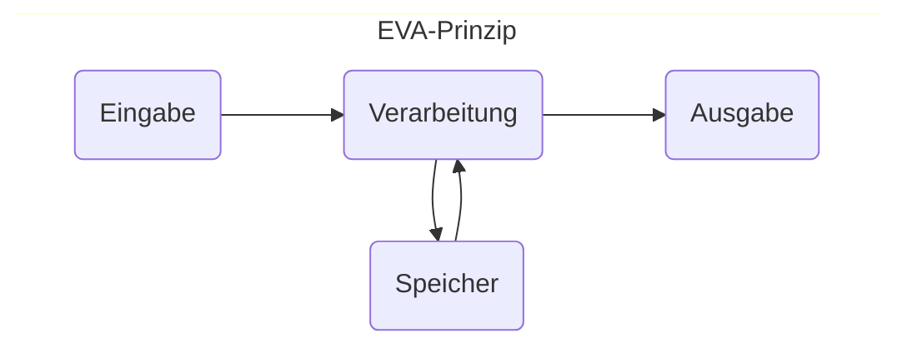

Beim Programmieren liegen Spass und Frust nahe beieinander - und den Unterschied macht Ihr Einsatz. Ich verspreche Ihnen vorweg so viel: Es ist keine Zauberei. **Alle können programmieren lernen**.

## EVA = Eingabe-Verarbeitung-Ausgabe

Beginnen wir weit vorne: Ein Computer ist im Grunde eine **Datenverarbeitungsmaschine**. **Inputs** aus Maus, Tastatur, Datenbanken, Game-Controllern, *et cetera* werden **verarbeitet** und die Resultate als **Outputs** ausgegeben an Bildschirmen, Lautsprechern, Motoren, und so weiter... Und vielleicht wird zwischendurch ein **Speicher** gelesen oder beschrieben.



Computerprogramme sind nun die Abläufe von Anweisungen–z.B. [[ginf-b01l01-algo|Algorithmen]]–, die in Ihrem Computer bei dieser Verarbeitung sagen, was er wann wie tun soll. Weil Computer von unterschiedlichen Menschen entwickelt werden und unterschiedliche Probleme lösen müssen, haben sich auch verschiedene **Programmiersprachen** entwickelt.

**Python** ist eine sehr allgemeine Programmiersprache, die besonders wegen ihrer einfachen Schreibweise (das nennt man den "**Syntax**") und wegen ihrer einfachen Erweiterbarkeit zur wohl populärsten Programmiersprache der Welt geworden ist. Dabei fungiert sie oft auch als Schnittstelle zwischen Programmen und Modulen, die in effizienteren Programmiersprachen geschrieben worden sind – wie zum Beispiel die Programmiersprachen **C und C++**.

## Ein minimalistisches Python-Programm

Beginnen wir mit einem kurzen Python-Programm aus zwei Linien. Führen Sie das gern einfach mal aus indem Sie auf "Start ▶️" drücken, dann besprechen wir den Inhalt.

```turtle
name = "Melanie"
print("Schön, dass Sie da sind, " + name + "! Willkommen!")
```

Hier wird ein Name gespeichert und dann als Teil eines Satzes wieder ausgegeben. Wir lernen daraus bereits:
- Das Programm wird **Schritt für Schritt** ausgeführt.
* Auf Linie 1 wird im Speicher eine **Variable** `name` erstellt und in ihr wird der **Wert** `"Melanie"` gespeichert. Wir lernen daraus bereits zwei Sachen:
	* Ein **Gleichheitszeichen** `=` beim Programmieren ist **kein *Ver*gleich**, sondern eine **Wert*zuweisung***.
	* Man kann in Python für eine **neue Variable einfach den Namen hinschreiben** und ihr einen Wert zuweisen. (So einfach geht das in anderen Programmiersprachen nicht!)
* Auf Linie 2 wird der Wert der Variable `name` in eine Zeichenkette eingefügt und mit der Funktion **print(...)** ausgegeben. Wir lernen:
	* Variablen und Funktionen sind unterschiedliche Dinge: **Variablen *speichern* etwas**, **Funktionen *tun* etwas**.
	* **Funktionen** erkennt man an den **runden Klammern**, in denen man der Funktion Werte zur Weiterverarbeitung übergeben kann, z.B. `print("Gebe diese Satz aus")`.
	* Man kann in Python verschiedene Zeichenketten einfach mit einem `+` zu einer Zeichenkette aneinanderketten.

> [!example] Jetzt sind Sie dran!
> 
> Ändern Sie den Namen, der ausgegeben wird und führen Sie das Programm aus.

Jetzt ändern wir das Programm ab, dass die Variable `name` nicht einen vordefinierten Wert speichert, sondern dass **unsere User nach ihrem Namen gefragt werden** und ihre Eingabe in der Variable `name` gespeichert wird. Das tönt kompliziert, aber tatsächlich übernimmt die Funktion `input()` die ganze Arbeit. 

```python {hl_lines="1"}
name = input("Bitte geben Sie Ihren Namen ein:")
print("Schön, dass Sie da sind, " + name + "! Willkommen!")
```

> [!example] Jetzt sind Sie dran!
> 
> Ändern Sie das Programm ab und führen Sie es aus.

```turtle
name = "Melanie"
print("Schön, dass Sie da sind, " + name + "! Willkommen!")
```

Daraus lernen wir:
* Der Wert für die Variable `name` wird nun **von der Funktion `input(...)`** geliefert. Das heisst: Funktionen können Werte nicht nur in den Klammern **entgegennehmen** ("Bitte geben Sie Ihren Namen ein") und **verarbeiten** (ein kleines Fensterchen mit diesem Satz anzeigen), sondern auch einen Wert **zurückgeben**. Funktionen können also alle Stationen des **EVA**-Prinzips.

> [!NOTE] Eintrag ins Theorieheft
> ## Unser erstes Programm
> ```
> name = "Melanie"
> print("Schön, dass Sie da sind, " + name + "! Willkommen!")
> ```
> Wir haben daraus gelernt:
> - Ein Programm wird **Schritt für Schritt** ausgeführt.
> - `name` ist eine **Variable** und speichert den Wert `"Melanie"`.
> - Ein einzelnes Gleichheitszeichen `=` ist beim Programmieren **kein *Ver*gleich**, sondern eine **Wert*zuweisung*** - z.B. oft für eine Variable.
> - **Funktionen** sind Teilprogramme, die etwas **tun**. Man erkennt sie an den **runden Klammern**, z.B. `print(...)`.
> - **Variablen *speichern* etwas**, **Funktionen *tun* etwas**.
> 
## Unser Programm mit bestehenden Bibliotheken erweitern

Sie sind sicher einverstanden, dass wir nur wissen, was die Funktionen `input(...)` und `print(...)` machen – aber wir haben keine Ahnung, wie sie tatsächlich funktionieren. Jemand hat diese Funktionen für uns programmiert und wir gebrauchen sie einfach. Das ist im Programmieren ganz oft so, dass wir **auf bestehendem Code aufbauen**.

`input(...)` und `print(...)`  gehören zum Standard-Repertoire von Python. Aber man kann die Sprache noch viel weiter erweitern mit **Modulen, Paketen und Bibliotheken** aus aller Welt.
* Ein **Modul** ist eine Python-Datei, deren Funktionen *et cetera* man importieren kann.
* Ein **Paket** ist ein ganzer Ordner voller Module, die ähnliche Dinge erledigen. Es kann auch Helferprogramme in anderen Programmiersprachen (Beispiel [Numpy](https://github.com/numpy/numpy)) enthalten.
* Eine **Bibliothek** ist ein vager Sammelbegriff und wird hier synonym für grössere Pakete verwendet.

Für diesen Einstieg werden wir eine Bibliothek namens "turtle" verwenden. Mit diesem Paket können wir einfache Zeichnungen erstellen und so visuell programmieren lernen. Beginnen wir damit, die Turtle-Bibliothek zu importieren:

```python
import turtle
```

Durch den Import der Turtle-Bibliothek haben wir nun Zugriff auf alles, was darin enthalten ist. Damit können wir jetzt eine Schildkröte erstellen und ihr einen Namen geben. Wir nennen unsere Schildkröte "eva", weil das kurz und bündig ist:

```python
eva = turtle.Turtle()
```

Nun können wir eva sagen, was sie tun soll. Beispielsweise können wir ihr sagen, dass sie 80 Schritte vorwärts gehen, sich um 60° nach rechts drehen und dann wieder 60 Schritte vorwärts gehen soll:

```python
eva.forward(80)
eva.right(60)
eva.forward(60)
```

Alles zusammen sieht dann so aus. Sie können das Programm ausführen, indem Sie auf "▶️ Run" drücken.

```turtle
import turtle
eva = turtle.Turtle()

eva.forward(80)
eva.right(60)
eva.forward(60)

```

Mit diesen wenigen Zeilen Code können Sie Ihrer Schildkröte "eva" also bereits einfache Anweisungen geben und Zeichnungen erstellen. 

> [!example] Jetzt sind Sie dran!
> 
> Versuchen Sie mal folgende Figuren nachzumachen. (Grösse und Farbe müssen nicht stimmen.)

![[Pasted image 20230627134624.png|invert]]
![[Pasted image 20230627134824.png|invert]]
![[Pasted image 20230627134709.png|invert]]
![[Pasted image 20230627135005.png|invert]]
![[Pasted image 20230807132453.png|invert]]


![[Pasted image 20230807132453.png|invert]]


> [!NOTE] Eintrag ins Theorieheft
> 
> ## Programme erweitern mit Turtle
> 
> - Programme kann man mit Modulen, Paketen und Bibliotheken erweitern.
> - Wir importieren die Bibliothek `turtle` mit dem Befehl `import turtle`
> - `eva = turtle.Turtle()` erzeugt eine Turtle mit dem Namen `eva`.
> - Die Turtle befolgt die Anweisungen **Schritt für Schritt**.
> - Die Turtle dreht sich um den **Aussenwinkel**.
> ![[Pasted image 20230818101343.png]]


[[ginf-b01l01-algo|Zurück zu L01]]
[[ginf-b01l03-wiederholungen|Weiter zu L03]]
